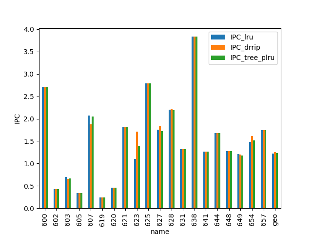
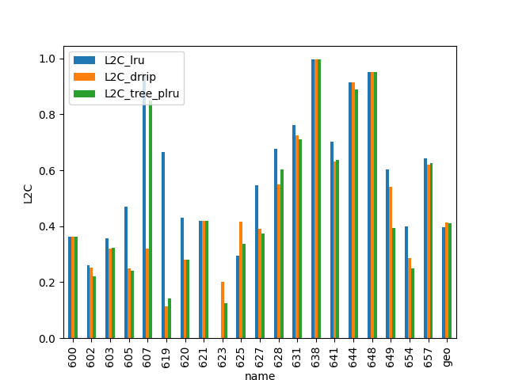
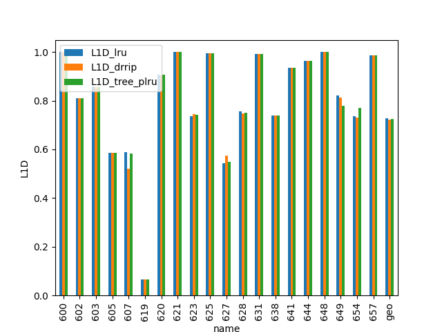
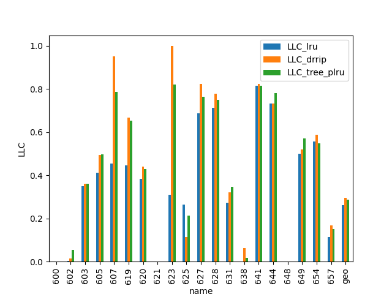

# Homework 2: L2 Cache Eviction Policies. Pseudo-LRU.

## Task

This task tests Tree-PLRU eviction policy and compares it with LRU and DRRIP policies.

Benchmarks and simulation options are the same as was in the [1st task](https://github.com/SlynkoDenis/ChampSim/tree/homework_1).

## Report

Tree-PLRU (tree-based pseudo-LRU) is an approximation of true LRU. It can be designed easier and work faster, which makes it a feasible solution. Though, because of being only an approximation, it is expected that Tree-PLRU would have worser quality compared to LRU.

The following values were used as quality metrics when comparing Tree-PLRU, LRU, DRRIP: `IPC, L2C Total Hit Rate, L1D Total Hit Rate, LLC (Last Level Cache) Total Hit Rate.`

### IPC

Tree-PLRU showed approximately the same IPC on most of the used benchmarks when being compared to LRU, which indirectly indicates it as a good LRU approximation. On several benchmarks (namely `623.xalancbmk_s-165B.champsimtrace.xz`, `627.cam4_s-490B.champsimtrace.xz`, `654.roms_s-293B.champsimtrace.xz`) DRRIP had significantly higher IPC, which resulted in the highest IPC by geometric mean. LRU and Tree-PLRU showed geomean IPC close to each other (1.227 vs 1.236 respectively), Tree-PLRU being slightly better.

### L2C Total Hit Rate

Comparing geomean hit rate gives the same picture as IPC with DRRIP being the best. Tree-PLRU showed results closed to DRRIP. It is worth mentioning that LRU showed near-zero hit rate when running benchmark `623.xalancbmk_s-165B.champsimtrace.xz`.

### L1D Total Hit Rate

L2 eviction policy influence L1D cache due to the hierarchical cache structure. L1D mean hit rate is opposite to that in L2 cache, though the difference between different policies is less significant than in L2.

### LLC Total Hit Rate

LLC hit rate bar-charts follow the same pattern as L2.
